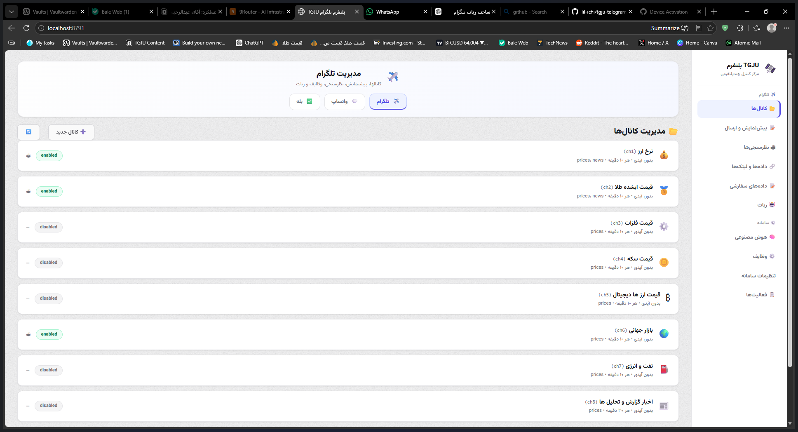

<div align="center">

# 🛰️ TGJU Telegram Platform

**Multi-channel market-data broadcasting & control center for [TGJU](https://www.tgju.org) (Tehran Gold & Currency Exchange)**

Automated Telegram channels, WhatsApp & Bale delivery, a full Persian RTL dashboard, and an optional AI layer — all from one FastAPI app.


</div>

---

## ✨ Overview

TGJU Telegram Platform is a production-grade control center that turns live
[TGJU](https://www.tgju.org) market data (currency, gold, coins, metals, global
markets, oil, crypto) into **scheduled, formatted posts** delivered to your own
Telegram channels — with an optional WhatsApp/Bale pipeline and a fully
configurable AI analysis layer.

Everything is managed from a **single-page Persian (RTL) dashboard**: channels,
post types, scheduling, preview & live posting, AI engines, connections,
settings, and logs.

> **Built for the Iranian market, engineered to be portable.** The app is
> fully self-contained — one directory, one venv, zero external services.

---

## 🚀 Features

| Area | Highlights |
|---|---|
| 📡 **Market data** | 230+ TGJU slugs (currency, gold, coins, metals, global indices, oil, crypto) with profile-page fallback for missing prices |
| 📣 **Channels** | 9 Telegram channels out of the box — prices, news, polls, AI analysis; full CRUD from the dashboard |
| 🤖 **Post engine** | Chip-format price tables, star ratings, TGJU analysis links, custom footers, per-channel templates |
| 🗞️ **News** | Rotating TGJU news summaries with full hyperlinks (text-only, safe) |
| 📊 **Polls** | Native Telegram polls from a safe interaction-focused pool, 4-hour rotation, anonymous (required for channels) |
| 🧠 **AI (optional)** | Per-channel analysis via any OpenAI-compatible endpoint — **off by default** (company rule: TGJU's own analysis is always the source) |
| 🕐 **Scheduler** | Priority scheduler (analysis → news → poll → rotation) with per-channel intervals; prices are never stolen by other jobs |
| 🖥️ **Dashboard** | Persian RTL single-page UI: channels, preview & post, AI control center, routing, categories, connections, settings, reports |
| 🔌 **Connections** | Live bot monitoring — `getMe`, `getChat`, `getChatMember` admin checks with 60s cache |
| 🌍 **Multi-platform** | Telegram + WhatsApp (Meta Cloud API) + Bale — managed from the same dashboard |
| 🏥 **Core services** | Health checks, idempotency, run history, events, approval flow (`platform/tgju_core/`) |

---

## 🖼️ Screenshots

| | |
|---|---|
| Dashboard — channel management (Persian RTL) |  |

---

## 📦 Quick Start

### Requirements

- **Python 3.11+** (3.10 may work; 3.11 is the tested baseline)
- A Telegram **bot token** from [@BotFather](https://t.me/BotFather)
- Your bot must be an **admin** of the target channel(s)

### 1. Get the code

```bash
git clone https://github.com/lil-ichi/tgju-telegram-platform.git
cd tgju-telegram-platform
```

### 2. Install

```bash
python -m venv .venv

# Windows
.venv\Scripts\activate
# Linux / macOS / git-bash
source .venv/bin/activate

pip install -r requirements.txt
```

### 3. Configure your bot token

The token is read from (highest priority first):

1. The active profile in `tgju/state/bot_profile.json` (created by the
   dashboard's **Bot** tab — recommended)
2. `TELEGRAM_BOT_TOKEN` in the legacy Hermes `.env` location
   (`%LOCALAPPDATA%\hermes\.env`), or in `~/.hermes/.env` on Unix

The `state/` directory is **auto-created on first boot** and is git-ignored —
you never need to commit anything to run the app.

### 4. Run

```bash
# Windows
start-platform.bat

# Linux / macOS / git-bash
./start-platform.sh
```

Then open **http://localhost:8791** — you'll see the login screen. The
platform is **private**: it ships with no credentials. The owner creates the
single login account locally before first start:

```bash
python scripts/setup_auth_local.py --username yourname --password 'yourpass'
# or via environment variables:
#   TGJU_AUTH_USERNAME=yourname TGJU_AUTH_PASSWORD=yourpass
```

> 🔐 **Why?** This repo is public on GitHub — anyone can download the code.
> The dashboard stays locked because valid credentials never leave your
> machine (they live in git-ignored `state/`). There is **no signup, no
> change-password option**, and only ONE account — only trusted members you
> give the credentials to can log in. See [SECURITY.md](SECURITY.md).

> **Tip:** `TGJU_PYTHON` environment variable overrides the Python
> interpreter used by the launcher scripts.

---

## 🗂️ Project Structure

```
tgju-telegram-platform/
├── platform/
│   ├── tgju_platform.py          # FastAPI app — dashboard + API + scheduler (:8791)
│   ├── tgju_platform_ui.html     # Persian RTL single-page dashboard
│   ├── channels.yaml             # Channel definitions (or edit via UI)
│   ├── tgju_engine_*.py          # Engine: scraping, formatting, news, polls, AI, WhatsApp, Bale
│   ├── tgju_multi.py             # CLI: --list / --preview <ch> / --post <ch> --real
│   ├── tgju_core/                # Core services: channels, health, runs, events, idempotency, secrets
│   └── state/                    # Runtime state (git-ignored, auto-created)
├── start-platform.bat            # Windows launcher (portable)
├── start-platform.sh             # Unix / git-bash launcher (portable)
├── requirements.txt
├── APP.md                        # Canonical agent-facing architecture doc
└── SECURITY.md
```

---

## 🔌 API Reference

| Method | Endpoint | Description |
|---|---|---|
| GET | `/api/status` | All channels + data age (instant, cached — never blocks on network) |
| GET | `/api/channels` | Full channel configuration |
| GET/POST/PUT/DELETE | `/api/channels[/{id}]` | Channel CRUD |
| GET | `/api/preview/{id}?type=prices\|news\|poll\|analysis\|all` | Post preview (never sends) |
| POST | `/api/post/{id}` | Live post with `post_type` |
| POST | `/api/refresh` | Schedule a fresh fetch (background, instant return) |
| GET/PUT | `/api/settings` | System settings |
| GET | `/api/connections`, `/api/connections/probe` | Live bot connection monitoring |
| GET | `/api/providers`, `/api/ai/*` | AI provider management, tests, runs |
| GET | `/api/functions` | Scheduled-function registry (analysis/news/poll) |
| GET/POST | `/api/bot*` | Bot profile management & activation |
| GET | `/api/logs` | System logs |

Full details live in [APP.md](APP.md).

---

## ⚙️ Post Types

| Type | Description |
|---|---|
| `prices` | Full chip-format price table + stars + TGJU analysis + footer |
| `news` | TGJU news summary (text + full hyperlink) |
| `poll` | Native Telegram poll from the safe 24-question pool (anonymous) |
| `analysis` | Optional AI-generated analysis — per-channel opt-in only |
| `all` | Prices + poll |

---

## 🤖 AI Layer (optional)

The platform can generate channel analysis through any OpenAI-compatible
endpoint (local LLMs included):

- Per-channel provider/model configuration with test & preview endpoints
- Orchestrator with 4 customizable jobs (analysis, poll selection, poll
  generation, news summary)
- **Company rule:** the analysis in posted messages is always TGJU's official
  text (full `og:description` + link). AI output is purely optional and off
  by default.

---

## 🧭 Roadmap

- [x] Test suite (`tests/`) — 47 tests, hermetic (no network/Telegram)
- [x] CI pipeline (`.github/workflows/ci.yml`) — Python 3.11/3.12 × Ubuntu/Windows
- [x] Proper packaging (`pyproject.toml`, `pip install -e .`)
- [x] Dockerfile (one-command deploy)
- [ ] GitHub Actions release workflow (tag → PyPI/ghcr)
- [ ] Webhook-based Telegram delivery (vs. polling)
- [ ] Multi-language post templates (EN/Farsi)

---

## ⚠️ Data & Disclaimer

- Market data is sourced from **TGJU** ([tgju.org](https://www.tgju.org)).
  This project is developed by a TGJU team member as an **internal automation
  tool** published for the community. It is an unofficial project — please
  refer to tgju.org for official data and services.
- Data is provided for **informational purposes only** — not financial advice.
  Verify before making any decision.
- Polls are interaction-focused and deliberately avoid market signals or
  anything that could put the channel owner at risk.

---

## 📄 License

[MIT](LICENSE) © 2026 Ichigho (lil-ichi)

---

## 🇮🇷 فارسی

### معرفی

پلتفرم کامل مدیریت کانال‌های بازار (قیمت‌ها، اخبار، نظرسنجی و تحلیل) بر پایه داده‌های
[TGJU](https://www.tgju.org) — با داشبورد فارسی RTL، زمان‌بندی خودکار، ارسال به
تلگرام / واتساپ / بله و لایه هوش مصنوعی اختیاری.

### راه‌اندازی سریع

```bash
git clone https://github.com/lil-ichi/tgju-telegram-platform.git
cd tgju-telegram-platform
python -m venv .venv
# ویندوز:
.venv\Scripts\activate
# لینوکس / مک / git-bash:
source .venv/bin/activate
pip install -r requirements.txt

# اجرا:
start-platform.bat        # ویندوز
./start-platform.sh       # لینوکس / مک / git-bash
```

سپس مرورگر: **http://localhost:8791**

- توکن بات را از [@BotFather](https://t.me/BotFather) بگیرید و در تب **بات** داشبورد ثبت کنید (بات باید ادمین کانال باشد).
- همه تنظیمات، کانال‌ها، پیش‌نمایش و ارسال از داشبورد انجام می‌شود؛ فایل `channels.yaml` نیز قابل ویرایش مستقیم است.
- دایرکتوری `state/` به‌صورت خودکار ساخته می‌شود و در گیت نادیده گرفته می‌شود (هیچ رازی کامیت نمی‌شود).
